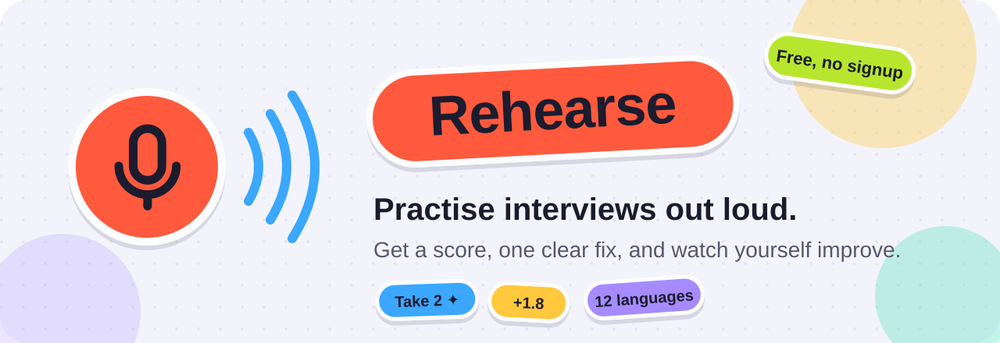
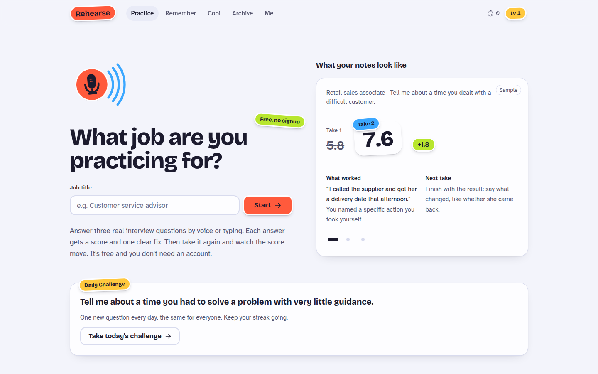
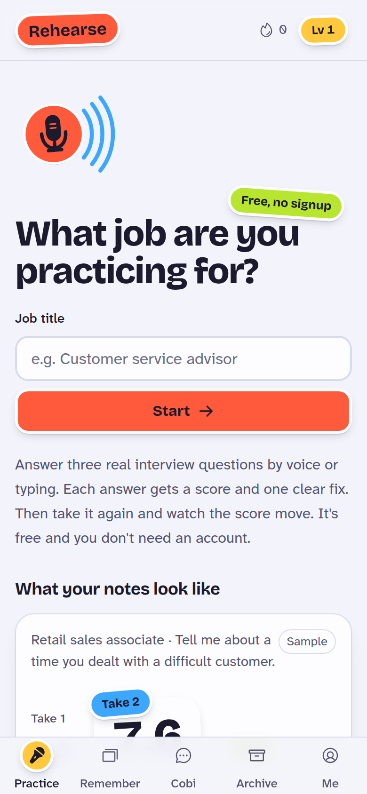
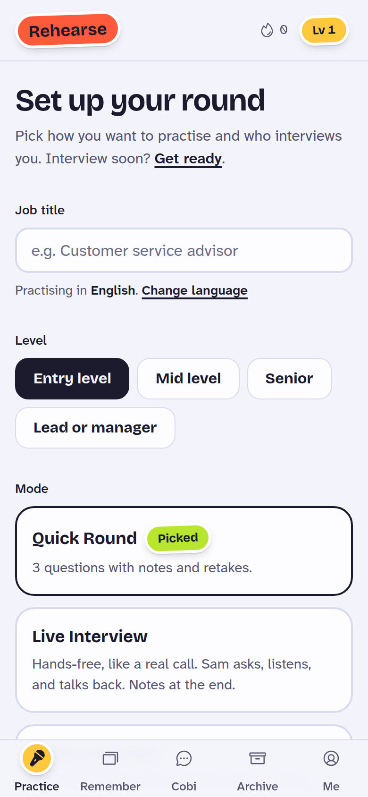
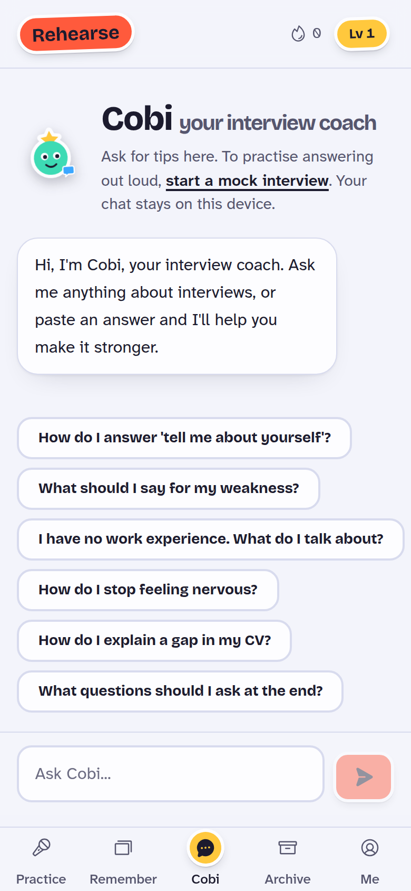
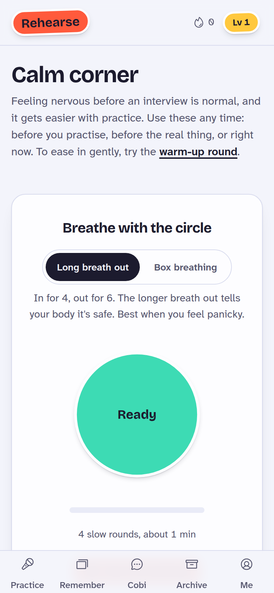
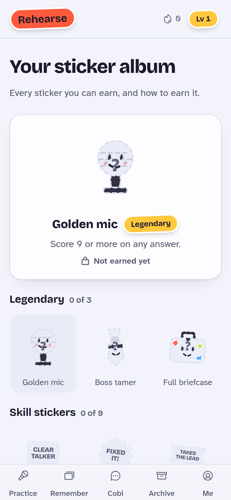

  

<h3 align="center">Your friendly interview practice partner. Free, no sign-up, works on your phone.</h3>

  
  
  
  

 

## 🎤 What is Rehearse?

Job interviews are scary mostly because we don't get to practise them. **Rehearse fixes that.**

Type the job you're going for, and Rehearse asks you real interview questions for that role. Answer out loud or type your answer, and you get:

- ⭐ **A score out of 10**, with the reasons behind it
- 🔧 **One clear thing to fix**, not a wall of advice
- 🔁 **A second go**, so you can watch your score go up

It feels more like a game than homework. You can collect stickers, level up and keep a streak going while you get better.

  

## ✨ How it works

<table>
<tr>
<td align="center" width="25%"><h1>1️⃣</h1><b>Name the job</b> Barista, nurse, software engineer… anything.</td>
<td align="center" width="25%"><h1>2️⃣</h1><b>Answer out loud</b> Or type, if you'd rather.</td>
<td align="center" width="25%"><h1>3️⃣</h1><b>Get your notes</b> A score and one clear fix per answer.</td>
<td align="center" width="25%"><h1>4️⃣</h1><b>Try again</b> Watch the number climb. 📈</td>
</tr>
</table>

## 🌈 A peek inside

  
  &nbsp;
  
  &nbsp;
  

  
  &nbsp;
  

## 🎁 What you can do

| | |
|---|---|
| 🗣️ **Live Interview** | A hands-free mock call. The interviewer asks out loud, listens, and replies like a real person. |
| ⚡ **Quick, Speed & Boss rounds** | Three quick questions, a race against the clock, or a tough final boss. |
| 📅 **Daily Challenge** | One new question every day, the same for everyone. Keep your streak alive. |
| 🤖 **Cobi, your coach** | Ask anything: "What's my weakness?", "How do I explain a gap in my CV?" |
| 🧠 **Remember** | Save your best answers and practise saying them from memory. |
| 🗓️ **Get ready** | Add your interview date for a day-by-day plan, plus a "Tell me about yourself" builder. |
| 🌿 **Calm corner** | Breathing exercises and grounding tips for when nerves kick in. |
| 🏆 **Stickers & levels** | 24 stickers to collect, from *Clear talker* to the legendary *Golden mic*. |
| 🌍 **12 languages** | Practise in the language of the job you want. |
| 📱 **Works offline** | Add it to your home screen and practise on the bus, even with no signal. |

## 🔒 Your privacy

- **No account and no sign-up.** Just open it and start.
- **Your progress stays on your device.** Scores, answers and streaks are saved in your browser. We don't keep a copy.
- **No ads and no selling data.** Your answers are never shared with employers.
- **Only what's needed.** To write your notes, the text of your answer goes to an AI service that doesn't keep it. The [privacy page](https://rehearse.sayamdev.workers.dev/privacy) has the full details.

## 💛 Who it's for

Students, first-job seekers, people changing careers, anyone practising in their second language, and anyone who has ever frozen at *"So, tell me about yourself."*

 

  <a href="https://rehearse.sayamdev.workers.dev"><b>👉 Start practising at rehearse.sayamdev.workers.dev</b></a>

 

---

  © 2026 Sayam Ajmal. All rights reserved. This code and content may not be copied, reused or redistributed without written permission. See <a href="LICENSE">LICENSE</a>. Developer notes live in <a href="docs">docs</a>.

